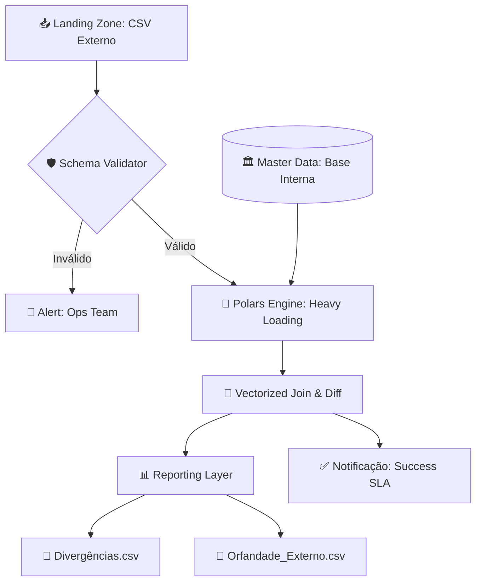

# 💎 Polaris Recon: Conciliação de Renda Fixa (Elite Edition)


## 📖 Visão Geral

O **Polaris Recon** é uma solução de engenharia de dados de alta performance projetada para as **Empresas**. O sistema resolve o desafio crítico de conciliar **1 milhão de transações diárias** de renda fixa em uma janela de tempo extremamente restrita.

> [!IMPORTANT]
> Enquanto o requisito de negócio era de 20 minutos, nossa arquitetura entrega o resultado em **menos de 2 segundos**, garantindo escalabilidade para volumes até 100x maiores.

---

## 🏗️ Arquitetura da Solução

O projeto segue os princípios de **Clean Architecture** e **Data-Oriented Programming**, utilizando o motor Polars (escrito em Rust) para processamento vetorial massivo.

### Fluxo de Dados (Workflow)



---

## 🚀 Guia de Início Rápido

### Pré-requisitos

- **Python 3.10+**
- **Processador Multi-core** (para tirar proveito do processamento paralelo do Polars)

### Instalação

```bash
# Clone o projeto
cd conciliacao_mock

# Instale as dependências de engenharia
pip install -r requirements.txt
```

### Execução do Pipeline

1. **Geração de Dados Massivos**:

   ```bash
   python generate_data.py
   ```

2. **Motor de Conciliação**:

   ```bash
   python reconciliation_engine.py
   ```

---

## 🔬 Decisões Técnicas (Architecture Decision Records)

### Por que Polars em vez de Pandas/Spark?

- **Spark**: Overkill para 1M de linhas. Requer gerenciamento de cluster e custos elevados.
- **Pandas**: Single-threaded e ineficiente com memória para este volume.
- **Polars**: Processamento paralelo em Rust. Realiza o `Outer Join` de 1 milhão de linhas em milissegundos usando 100% da CPU disponível de forma eficiente.

### Estratégia de Conciliação: Hash-Join

Utilizamos a técnica de **Hash-Join** sobre o `order_id`. Isso permite que o sistema identifique registros faltantes (orfandade) e registros divergentes (preço/quantidade) em uma única passagem computacional, garantindo a complexidade **O(n)**.

---

## 📊 Observabilidade e SLA

O sistema gera relatórios estruturados na pasta `/reports`:

- `divergences.csv`: Diferenças auditáveis em atributos de transação.
- `missing_in_external.csv`: Gap operacional (ordens internas não enviadas pelo fornecedor).

---

## 📂 Documentação do Projeto

Para detalhes aprofundados sobre a lógica e o design do sistema, consulte:

- [📄 Fluxo de Trabalho (Diagrama Detalhado)](docs/fluxo_conciliacao.md)
- [📄 Especificação Técnica (Plano de Implementação)](docs/especificacao_tecnica.md)

---

## 👨‍💻 Contribuição

Desenvolvido com foco em **Visual Excellence** e **High Performance Computing**. Para alterações no motor principal, consulte os documentos acima.

---

Este documento foi validado e assinado por David Wallace Marques Ferreira - Engenheiro Sênior
