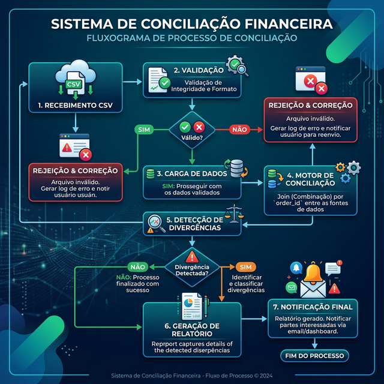
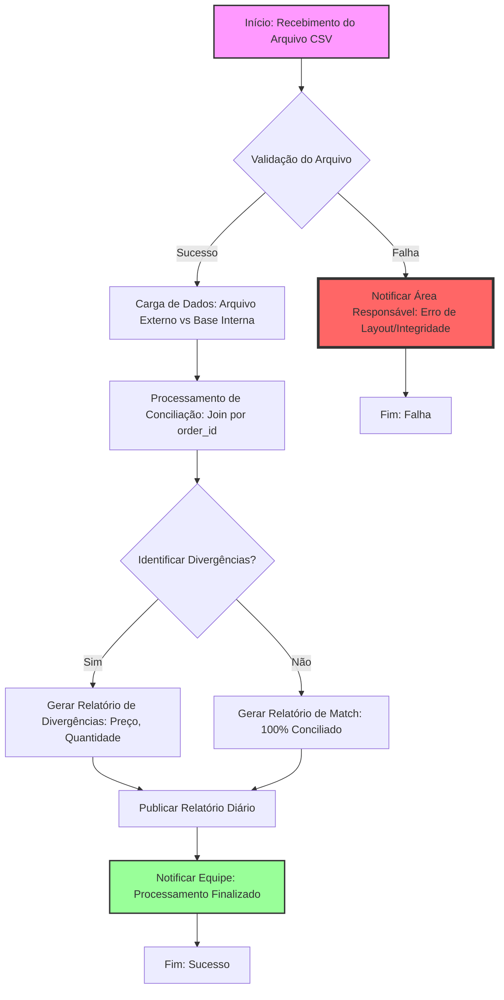

# Fluxo de Trabalho: Conciliação de Renda Fixa (Corporativo)

Este artefato descreve o fluxo operacional e técnico para a conciliação diária de ativos de renda fixa.

## Diagrama do Fluxo (Visualização Direta)

## Diagrama do Fluxo (Mermaid Acadêmico)

## Detalhamento das Etapas

### 1. Recebimento e Ingestão

- **Frequência**: Diário (Uma vez por dia).
- **Formato**: CSV com colunas específicas: `external_id`, `order_id`, `order_datetime`, `asset_id`, `trading_account`, `quantity`, `unit_price`, `transaction_type`.
- **Volume**: ~1.000.000 de registros.

### 2. Validação (SLA: 20min)

- Para garantir o SLA de 20 minutos, a validação deve ser feita em paralelo ou via stream.
- Campos como `order_id` e `external_id` são obrigatórios para a chave de busca.

### 3. Motor de Comparação (Critérios)

- **Chave Primária**: `order_id`.
- **Campos Comparados**:
  - `quantity`: Diferença entre o reportado pelo fornecedor e o sistema interno.
  - `unit_price`: Validação de preço de execução.
  - `trading_account`: Validação se a conta de destino está correta.

### 4. Resultados e Notificações

- **Sucesso**: Disponibilização do relatório em 20 minutos após o recebimento.
- **Erro Crítico**: No caso de falha no servidor de processamento ou timeout do banco de dados, a área responsável é alertada imediatamente via sistemas de monitoramento (ex: E-mail, Slack, OpsGenie).

---

> [!IMPORTANT]
> O processamento deve ocorrer dentro de uma janela de 20 minutos para atender aos requisitos de negócio.

---

Este documento foi validado e assinado por David Wallace Marques Ferreira - Engenheiro Sênior
